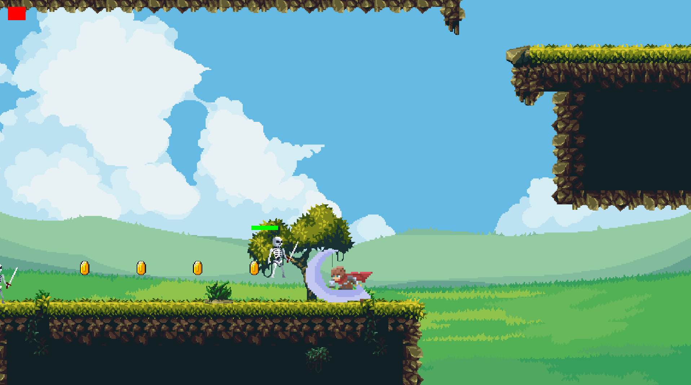
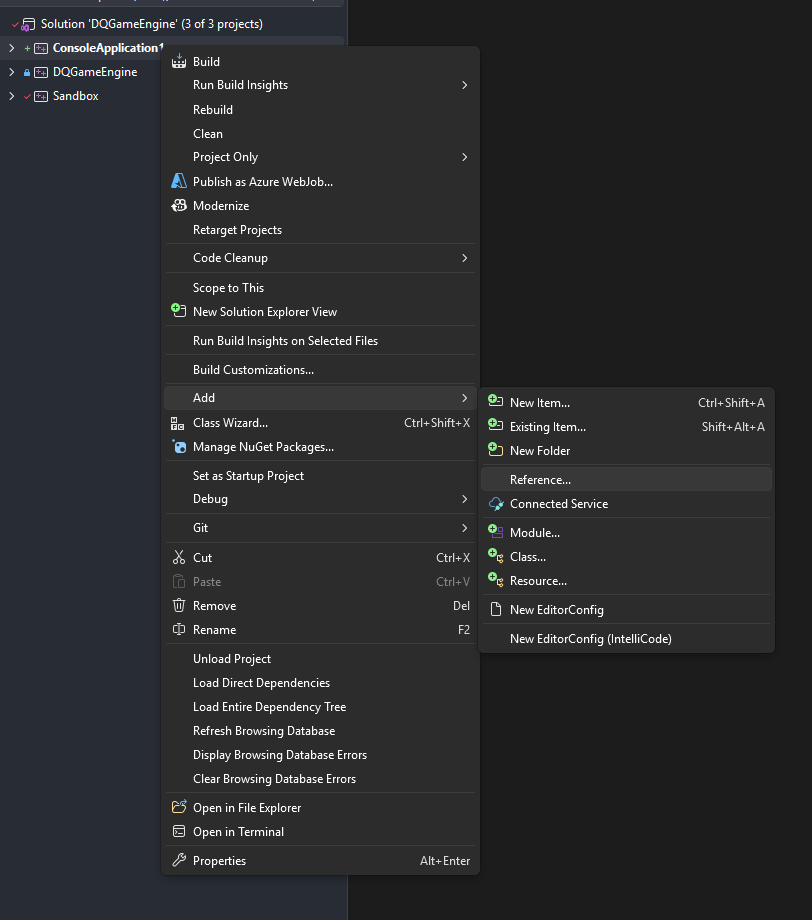
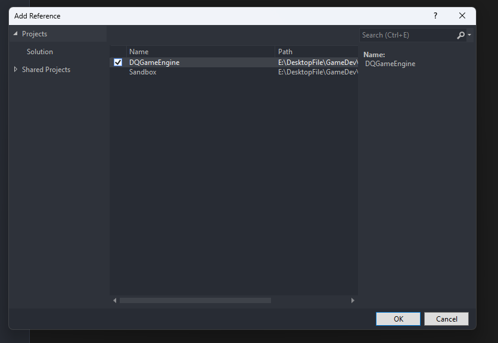
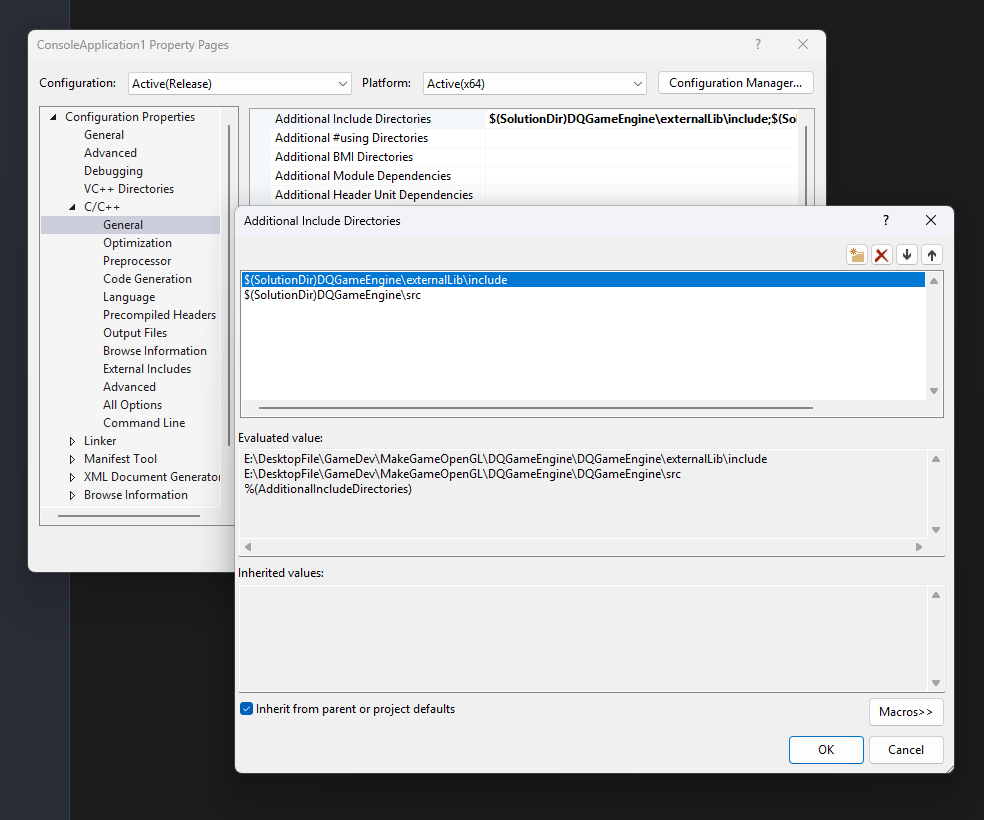
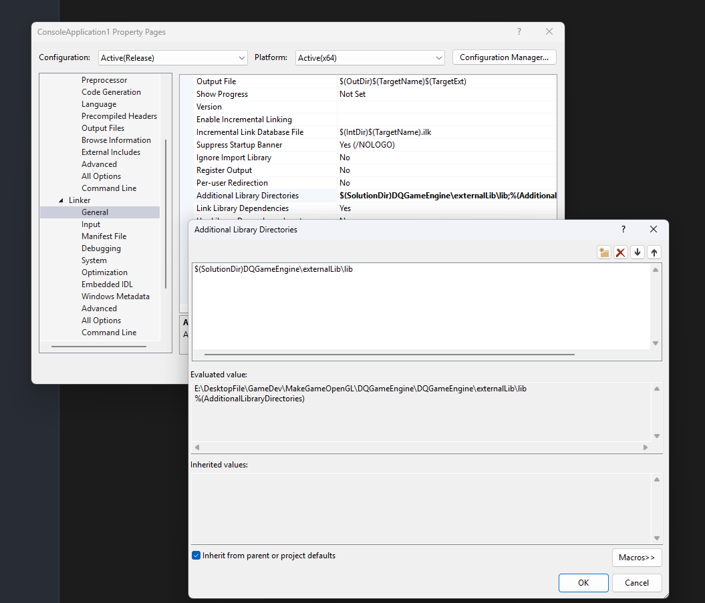

# DQGameEngine 🎮


**DQGameEngine** is a custom 2D C++ game engine designed for educational and performance-focused game development. The repository includes both the core engine architecture and a **Sandbox** project demonstrating the engine's capabilities.

## Sandbox Demo Image



## 🌟 Features

- **2D Rendering Engine:** Modern OpenGL pipeline with Glad loader, supporting 2D sprite batching, custom shader management, and texture atlases.
- **2D Camera System:** Dynamic 2D camera supporting target tracking, smooth follow (Lerp), zoom controls, and viewport boundary clamping.
- **Animation System:** Frame-based sprite-sheet animation manager with configurable playback rates, integrated with a Finite State Machine (FSM) for character state transitions.
- **Collision Detection & Spatial Partitioning:** Axis-Aligned Bounding Box (AABB) collision detection and resolution algorithms, optimized with a **Spatial Grid** for fast broad-phase collision filtering and dynamic entity partitioning.
- **Windowing & Input:** Powered by **SDL3** for cross-platform window handling, graphics context creation, and real-time event processing.
- **Tilemap Support:** Native `.tmx` Tiled map parsing and multi-layer rendering integrated with **tmxlite**.
- **Math Library:** Hardware-accelerated vector and matrix calculations powered by **GLM**.

## ⚙️ Installation & Setup

### Prerequisites
- **Operating System:** Windows 10 / 11 (64-bit)
- **IDE:** Visual Studio 2022 with **Desktop development with C++** workload installed.

---

### Option 1: Quick Run / Build Demo (Sandbox)

If you want to test or run the included **Sandbox** demo:

1. Go to the **Releases** section on the right side of this repository.
2. Download the latest `DQGameEngine.zip` package.
3. Extract the `.zip` archive.
4. Open `DQGameEngine.sln` in **Visual Studio 2022**.
5. In the **Solution Explorer**, right-click on the **Sandbox** project and select **Set as Startup Project**.
6. Set the build configuration to **Debug** or **Release** (x64) and press `F5` (or click **Local Windows Debugger**) to compile and launch the demo.

---

### Option 2: Using Core Engine for Your Own Game Project

The solution is architected around two core project types:
- **`DQGameEngine`**: The core engine compiled as a static library (`.lib`).
- **`Sandbox`**: An example executable project implementing game logic using the engine API.

To create and configure your own new C++ game project inside the solution:

#### 1. Add Core Engine Reference
Right-click your newly created project in **Solution Explorer** $\rightarrow$ **Add** $\rightarrow$ **Reference...**



In the **Add Reference** window, check **DQGameEngine** under **Projects** and click **OK**.



---

#### 2. Configure Include Directories
Go to Project **Properties** $\rightarrow$ **C/C++** $\rightarrow$ **General** $\rightarrow$ **Additional Include Directories**, and add:
- `$(SolutionDir)DQGameEngine\externalLib\include`
- `$(SolutionDir)DQGameEngine\src`



---

#### 3. Configure Linker Directories
Go to **Properties** $\rightarrow$ **Linker** $\rightarrow$ **General** $\rightarrow$ **Additional Library Directories**, and add:
- `$(SolutionDir)DQGameEngine\externalLib\lib`



---

#### 4. Add Additional Dependencies
Go to **Properties** $\rightarrow$ **Linker** $\rightarrow$ **Input** $\rightarrow$ **Additional Dependencies**, and add the required external libraries:
```text
SDL3.lib
SDL3_image.lib
SDL3_mixer.lib
SDL3_test.lib
SDL3_ttf.lib
opengl32.lib
tmxlite.lib
